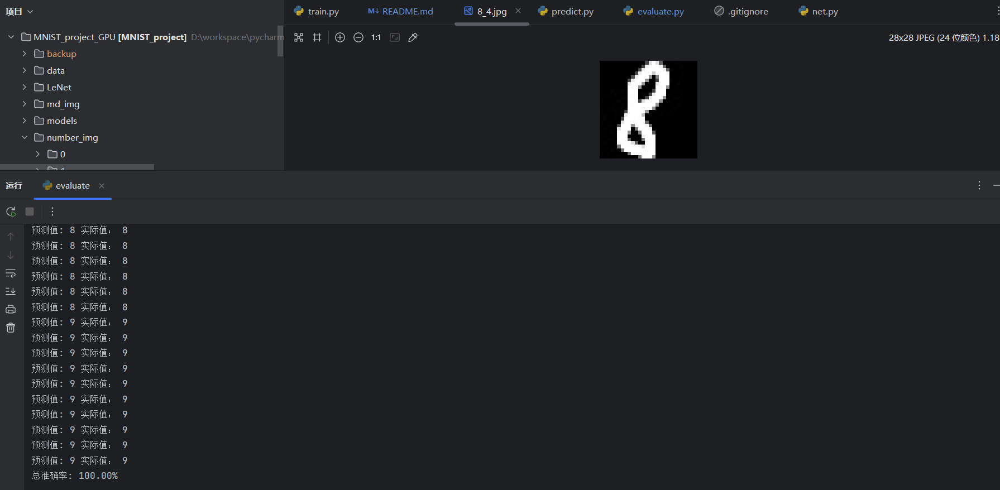

# 基于LeNet神经网络的手写数字识别小项目
## 项目简介
本项目是一个手写数字识别的小项目，使用的网络由三层卷积，三层池化和三层全连接层组成，并添加了dropout来防止过拟合
项目使用MNIST数据集进行训练，并对MNIST进行了数据增强，以达到更好的训练效果，训练的优化器使用随机梯度下降SGD优化函数，并使用交叉熵损失CrossEntropyLoss作为损失函数。
项目对模型的推理结构作了简单的可视化处理，推理使用的图片为最终评估时的测试集中随机三张图片。
## 测试结果
项目使用自制的100张手写数字图片来进行评估，目前准确率在测试集上达到99%以上（测试集上实际表现为100%但是准确率理论上不会达到100%）

